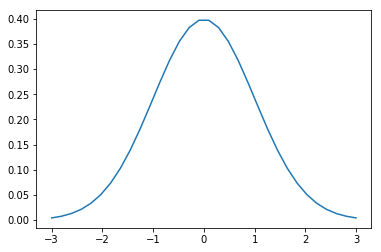
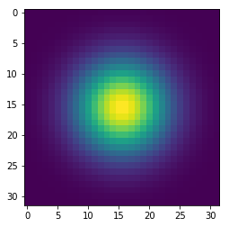
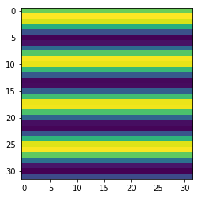
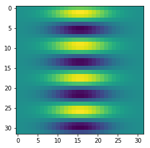

# Basic operations 
Some simple matrix operations.


```python
import tensorflow as tf
import cv2
import matplotlib.pyplot as plt
```


```python
sess = tf.InteractiveSession()
```


```python
n = 32
x = tf.linspace(-3.0,3.0,n)
sigma = 1.0
mean = 0.0
z = (tf.exp(-(tf.pow(x - mean, 2.0)/(2.0*tf.pow(sigma,2.0))))*(1.0/(sigma*tf.sqrt(2.0*3.1415))))
plt.plot(x.eval(),z.eval())
plt.show()
```





Basic functions can be defined, but the operations must be using the tensoflow functions. Usually it is as simple as adding a 'tf.' before the fucntion needed


```python
z_2d = tf.matmul(tf.reshape(z,[n,1]), tf.reshape(z,[1,n]))
plt.imshow(z_2d.eval())
plt.show()
```





Normal matrix multiplicatins works just fine with 'tf.matmul'


```python
x = tf.reshape( tf.sin(4*tf.linspace(-3.0,3.0, n)),[n,1])
y = tf.reshape( tf.ones_like(x), [1,n])
plt.imshow(tf.matmul(x,y).eval())
plt.show()
```





Elementwise multiply is possible with 'tf.multiply'


```python
z =  tf.multiply(tf.matmul(x,y),z)
plt.imshow(z.eval())
plt.show()
```





Broadcasting operation works good as well. Case below is that we want to scale the gabor function. 


```python
k = tf.constant(2.0)
plt.imshow((k*z).eval())
plt.show()
```


```python

```
