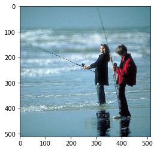
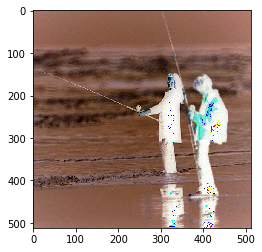

## Introduction

A quick intro into tensorflow basics from various sources. Mainly [1](https://github.com/pkmital/tensorflow_tutorials/blob/master/python/01_basics.py) and [2](https://www.tensorflow.org/tutorials/)  
After install, we do the basic imports. matplotlib is used for plots.


```python
import tensorflow as tf
import matplotlib.pyplot as plt
```

Tensorflow computes everythign using tensors. Assuming familiarity with python classes, Tensor is roughly,    
```c
class tensor:  
    content // (needs to be computed by a 'tensorflow session' later)    
    rank  
    shape  
    dtype  
```

```python
n = 32
x = tf.linspace(-3.0,3.0,n)
print (x)
```

    Tensor("LinSpace:0", shape=(32,), dtype=float32)
    


```python
x = tf.linspace(-3.0,3.0,n, name='my_name')
x2 = tf.linspace(-3.0,3.0,n, name='my_name')
print (x)
print (x2)
```

    Tensor("my_name:0", shape=(32,), dtype=float32)
    Tensor("my_name_1:0", shape=(32,), dtype=float32)
    

All the computations are store in a graph. This can be visualized and output at each stage can be seen. The outputs are more tensors.


```python
g = tf.get_default_graph()
[op.name for op in g.get_operations()]
```


    ['LinSpace/start',
     'LinSpace/stop',
     'LinSpace/num',
     'LinSpace',
     'my_name/start',
     'my_name/stop',
     'my_name/num',
     'my_name',
     'my_name_1/start',
     'my_name_1/stop',
     'my_name_1/num',
     'my_name_1']


```python
g.get_tensor_by_name('LinSpace' + ':0')
```


    <tf.Tensor 'LinSpace:0' shape=(32,) dtype=float32>


Making a session : To compute anything you need this

*. Use a session to compute a tensor


```python
sess = tf.Session()
result = sess.run(x)
print (result)
```

    [-3.         -2.80645156 -2.61290312 -2.41935492 -2.22580647 -2.03225803
     -1.83870971 -1.64516139 -1.45161295 -1.25806451 -1.06451619 -0.87096786
     -0.67741942 -0.48387098 -0.29032278 -0.09677434  0.0967741   0.29032254
      0.48387098  0.67741919  0.87096763  1.06451607  1.25806427  1.45161295
      1.64516115  1.83870935  2.03225803  2.22580624  2.41935444  2.61290312
      2.80645132  3.        ]
    

*. Tell a tensor to compute using session


```python
print( x.eval(session = sess))
sess.close()
```

    [-3.         -2.80645156 -2.61290312 -2.41935492 -2.22580647 -2.03225803
     -1.83870971 -1.64516139 -1.45161295 -1.25806451 -1.06451619 -0.87096786
     -0.67741942 -0.48387098 -0.29032278 -0.09677434  0.0967741   0.29032254
      0.48387098  0.67741919  0.87096763  1.06451607  1.25806427  1.45161295
      1.64516115  1.83870935  2.03225803  2.22580624  2.41935444  2.61290312
      2.80645132  3.        ]
    

*. Making an interactive session


```python
sess = tf.InteractiveSession()
x.eval() #No explicit session required
```


    array([-3.        , -2.80645156, -2.61290312, -2.41935492, -2.22580647,
           -2.03225803, -1.83870971, -1.64516139, -1.45161295, -1.25806451,
           -1.06451619, -0.87096786, -0.67741942, -0.48387098, -0.29032278,
           -0.09677434,  0.0967741 ,  0.29032254,  0.48387098,  0.67741919,
            0.87096763,  1.06451607,  1.25806427,  1.45161295,  1.64516115,
            1.83870935,  2.03225803,  2.22580624,  2.41935444,  2.61290312,
            2.80645132,  3.        ], dtype=float32)


### Tensorflow variables


```python
x = tf.constant(35)
y = tf.Variable(x+5)
#print(y.eval()) ## Will generate error
```


```python
init = tf.global_variables_initializer()
sess.run(init) ## This must be implemeted before variable value can be computed
print( y.eval() )
```

    40
    


```python
y = tf.assign(y,32) #Variable are updated like this
print( y.eval() )
```

    32
    

### Reading inputs

A placeholder variable is used to reserve location for an input to be read. Here if we choose an image as input, the code will go like this.


```python
from skimage import io
import numpy as np
sess = tf.InteractiveSession()
img =( io.imread('fisher.png') )
np_image_data = np.float32(np.asarray(img))
#img = np_image_data[1:200,1:200,0]
plt.imshow(img)
plt.show()
```





Let some function be defined that does some processing on the inputs. Like a scaling one below. The inputs will be read on to a placeholder variable (needs dtype and shape can either be defiend or left as None for runtime)


```python
def scaled(img, W):    
    val = img*W
    return val

x = tf.placeholder(tf.float32,shape=None)
k = 2*tf.ones(img.shape)
out = scaled(x, k)
```


```python
result =sess.run(x, feed_dict={x:img})
```


```python
plt.imshow(result)
plt.show()
```



